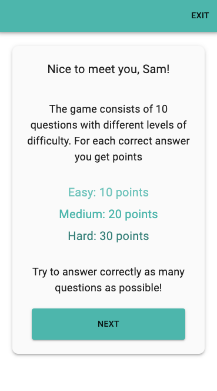

# Monday Quiz Game

## Stack

Front-End:

- React (CRA) 16.8
- Material-UI 4.12

## Description

Application is responsive and can be viewed on device of any screensize.

Application is dividied into three parts:

- Welcoming part (enter user's name, present the rules, choose category of the questions)
- Game
- Results

### Welcoming part

### Game

Each question has a 20 seconds timer.
When time is up, answer buttons are replaced by "next" button which is automatically considered as wrong answer.

The bottom part of the Game has "Progress bar", which shows approximately to the user how much is left to play, and "Progress List" which shows questions the user answered correctly and incorretly.

### Results

On the Results window the score is presented to the user along with percentage of correct/incorrect answers.
The user can choose to play a new game (and is redirected to choosing the category) or to exit (and is redirected to the welcoming window).

## Links

Live Site URL: [https://roaring-pudding-226a51.netlify.app/](https://roaring-pudding-226a51.netlify.app/)
